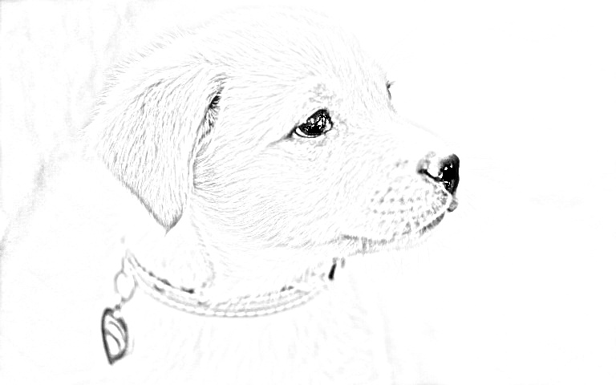

<h1 align='center'><ins>
Imagen a Boceto </ins></h1>

Este codigo, desarrollado en y para los Data Engineers, muestra como podemos pasar de una foto cualquiera a un boceto en lapiz, utilizando la libreria de python 'OpenCV'
### Imagen Lograda: 

### Imagen original: 

